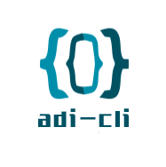

<!--
 * @Author: ADI
 * @Date: 2020-12-30 18:10:07
 * @LastEditors: ADI
 * @LastEditTime: 2020-12-30 18:19:24
-->
<p align="center">
  
</p>

A super-simple way to create new projects based on templates.

Inspired by [Khaos](https://github.com/segmentio/khaos), but with a better CLI, schemas and a more up-to-date code.

## Install

```sh
npm install -g adi-cli
```

or

```sh
yarn global add adi-cli
```

## Usage

- Create
  - `adi-cli create <template name> <project name>`
  - project name
    - `vue2+ts`
    - `vue2+ts2`
- Templates
  - `adi-cli list`
- Help
  - `adi-cli --versions`

## License

MIT © Fabio Spampinato
