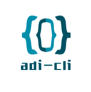

<!--
 * @Author: ADI
 * @Date: 2020-12-30 18:10:07
 * @LastEditors: ADI
 * @LastEditTime: 2021-01-22 09:19:09
-->
<p align="center">
  
</p>

[](https://www.npmjs.com/package/adi-cli) [](https://www.npmjs.com/package/adi-cli) [](https://www.npmjs.com/package/adi-cli)

A super-simple way to create new projects based on templates.

Inspired by [Khaos](https://github.com/segmentio/khaos), but with a better CLI, schemas and a more up-to-date code.

## Install

```sh
npm install -g adi-cli
```

or

```sh
yarn global add adi-cli
```

## Usage

- Create
  - `adi-cli create <project name>`
- Templates
  - `adi-cli list`
- Version
  - `adi-cli --version`
- Help
  - `adi-cli --help`

## Upgrade log

- adi-cli@1.1
  - [x] 加入 typeScript 支持
  - [x] 加入开发模式 `yarn run dev`
  - [x] 重新组织合理的文件结构
  - [x] JSON 格式配置项目模板
  - [x] 添加指令`-h -help -v -version -list`
  - [x] `adi-cli create <project name>` && adi-cli select templates option
  - [x] log `cd <project name>` && yarn i && git init

## License

MIT © Fabio Spampinato
